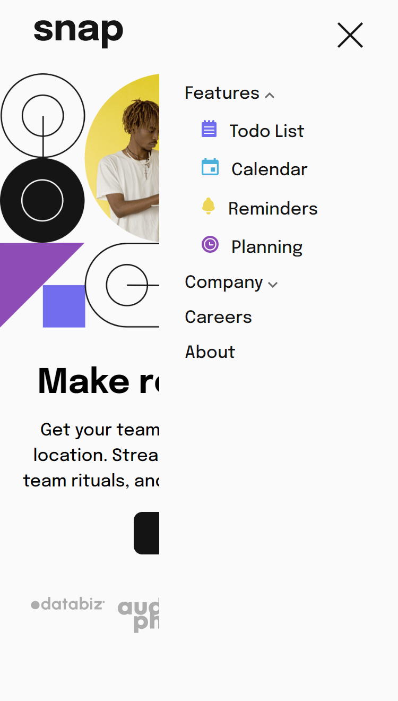

# Frontend Mentor - Intro section with dropdown navigation solution

This is a solution to the [Intro section with dropdown navigation challenge on Frontend Mentor](https://www.frontendmentor.io/challenges/intro-section-with-dropdown-navigation-ryaPetHE5). Frontend Mentor challenges help you improve your coding skills by building realistic projects. 

## Table of contents

- [Overview](#overview)
  - [The challenge](#the-challenge)
  - [Screenshot](#screenshot)
  - [Links](#links)
- [My process](#my-process)
  - [Built with](#built-with)
- [Author](#author)

## Overview

## The challenge

-  View the relevant dropdown menus on desktop and mobile when interacting with the navigation links
-  View the optimal layout for the content depending on their device's screen size
-  See hover states for all interactive elements on the page

### Screenshot

 | 

### Links

- [Solution URL](https://www.frontendmentor.io/profile/vikrantmalla)
- [Live Server](https://vikrantmalla.github.io/intro-section-with-dropdown-navigation/)

### Built with

- Semantic HTML5 markup
- SCSS
- JavaScript
- Flexbox
- Mobile-first workflow
- Media Queries

## Author

- GitHub - [Vikrant Malla](https://github.com/vikrantmalla)
- Frontend Mentor - [@vikrantmalla](https://www.frontendmentor.io/profile/vikrantmalla)
